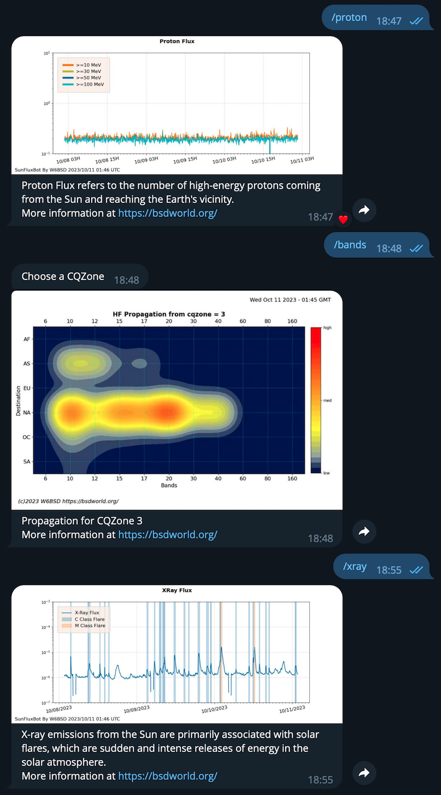

# SunBot
Sun activity and propagation bot for telegram.

This Telegram bot informs ham radio operators about solar weather, propagation, and amateur radio
activity on HF bands.

If your ham club uses a [Telegram](https://telegram.org) group, you can offer this service to your
members by inviting the bot [@SunFluxBot](http://t.me/SunFluxBot) into your group. Then, send the
command /help to the bot and follow the instructions.

For more information check [0x9900's blog](https://0x9900.com/telegram-propagation-bot/) post

73 and happy DXing.
